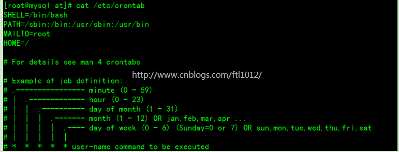
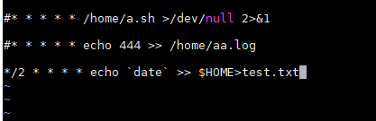

# linux定时任务，crontab命令
参考地址&nbsp;[https://www.cnblogs.com/ftl1012/p/crontab.html](#https://www.cnblogs.com/ftl1012/p/crontab.html)

linux定时任务可以定时执行某个脚本，或者某个命令

## 1. 常见命令参数
```
usage:  crontab [-u user] file
        crontab [-u user] [ -e | -l | -r ]
                (default operation is replace, per 1003.2)
        -e      (edit user's crontab)
        -l      (list user's crontab)
        -r      (delete user's crontab)
        -i      (prompt before deleting user's crontab)
        -s      (selinux context)
```

## 2. 定时任务分类

Linux下的任务调度分为两类，系统任务调度和用户任务调度。

### 2.1 系统任务调度

系统周期性所要执行的工作，比如写缓存数据到硬盘、日志清理等。
在/etc/crontab文件，这个就是系统任务调度的配置文件。
        
### 2.2 用户任务调度

用户定期要执行的工作，比如用户数据备份、定时邮件提醒等。
用户可以使用 crontab 工具来定制自己的计划任务。
在crontab 文件都被保存在/var/spool/cron目录中。其文件名与用户名一致

## 3. 定时任务定时参数设置


```
前四行是用来配置crond任务运行的环境变量
第一行SHELL变量指定了系统要使用哪个shell，这里是bash
第二行PATH变量指定了系统执行命令的路径
第三行MAILTO变量指定了crond的任务执行信息将通过电子邮件发送给root用户
如果MAILTO变量的值为空，则表示不发送任务执行信息给用户
第四行的HOME变量指定了在执行命令或者脚本时使用的主目录。
星号（*）：代表所有可能的值，如month字段为星号，则表示在满足其它字段的制约条件后每月都执行该命令操作。
逗号（,）：可以用逗号隔开的值指定一个列表范围，例如，“1,2,5,7,8,9”
中杠（-）：可以用整数之间的中杠表示一个整数范围，例如“2-6”表示“2,3,4,5,6”
正斜线（/）：可以用正斜线指定时间的间隔频率，例如“0-23/2”表示每两小时执行一次。
```
注意：第五条尤为重要
```
1. 数字的表示最好用2为阿拉伯数字显示
2. 周和日最好不要同时用
3. 定时任务要加注解
4. 可以定向到日志文件或者空文件
5. 定时任务一定是绝对路径，且目录必须存在才能出结果，定时任务调用的脚本也是，里面必须写绝对路径
6. crontab 服务一定要开启运行
```

# 4. 编辑定时任务
直接执行 "crontab –e "这条命令，就可以创建自己的定时任务，该命令实际上就是打开了
定时任务的编辑文件

注意这种方式创建的定时任务只是
基于用户的定时任务，如果需要加入系统的定时任务，则可以把定时任务添加到如下的文件夹里面
```
执行 ls /etc/cron*
会输出如下的几个文件/文件夹
cron.d
cron.daily
cron.hourly
cron.monthly
crontab
cron.weekly
```
### 4.1 创建定时任务举例
```
crontab –e
#每隔2分钟输出时间到文件
*/2 * * * * echo `date` >> $HOME>test.txt
```


### 4.2 查看定时任务列表

crontab -l ,该命令会显示当前用户自定义的定时任务列表

### 4.3 删除定时任务

crontab -r ,该命令删除当前用户全部定时任务，使用时一定要注意，确认后再使用，
如果想删除某些定时任务时则可以使用crontab -e,进入创建定时任务文件，把定时任务单独去掉即可

# 注意事项
```
1. 当crontab突然失效时，可以尝试/etc/init.d/crond restart解决问题。或者查看日志看某个job有没有执行/报错tail -f /var/log/cron。
2. 千万别乱运行crontab -r。它从Crontab目录（/var/spool/cron）中删除用户的Crontab文件。删除了该用户的所有crontab都没了。
3. 在crontab中%是有特殊含义的，表示换行的意思。如果要用的话必须进行转义\%，如经常用的date ‘+%Y%m%d’在crontab里是不会执行的，应该换成date ‘+\%Y\%m\%d’
4. 找不到cron启动日志原因：crontab的日志，在有的系统里面默认是关闭的，可以在/etc/rsyslog.d/50-default.conf里面
把cron的注释去掉
5. 当手动执行脚本OK，但是crontab死活不执行时。可以尝试在crontab中直接引入环境变量解决问题。
```
