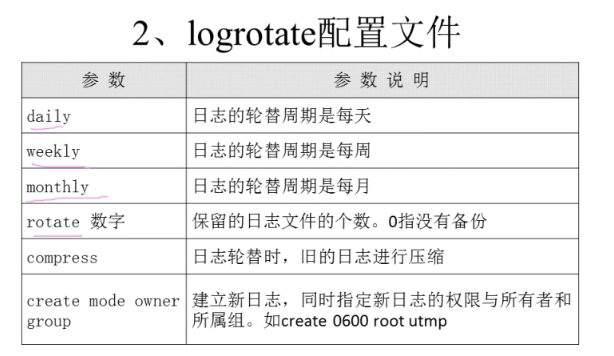
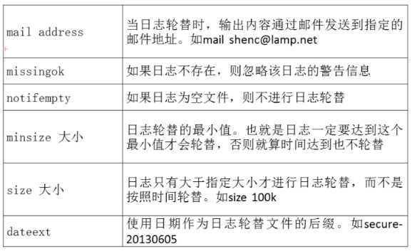
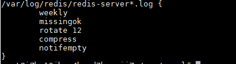
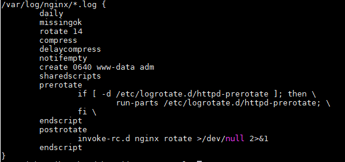
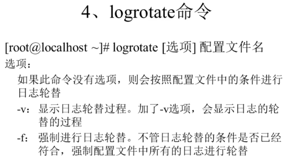
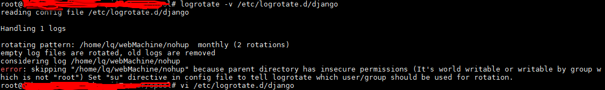
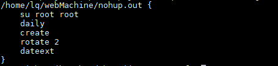
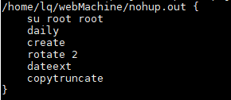

# 目录

[目录](#目录)

[1. 日志轮替](#1-日志轮替)

&nbsp;&nbsp;&nbsp;&nbsp;[1.1 日志文件配置参数如下](#11-日志文件配置参数如下)

&nbsp;&nbsp;&nbsp;&nbsp;[1.2 日志文件的命名规则](#12-日志文件的命名规则)

&nbsp;&nbsp;&nbsp;&nbsp;&nbsp;&nbsp;&nbsp;&nbsp;[1.2.1 日期记录文件名字，配置文件中加"dateext"参数](#121-日期记录文件名字配置文件中加dateext参数)

&nbsp;&nbsp;&nbsp;&nbsp;&nbsp;&nbsp;&nbsp;&nbsp;[1.2.2 按照顺序记录文件名字，配置文件中没有"dateext"参数](#122-按照顺序记录文件名字配置文件中没有dateext参数)

&nbsp;&nbsp;&nbsp;&nbsp;[1.3 手动进行日志轮替](#13-手动进行日志轮替)

[注意](#注意)

====================

# 1. 日志轮替
rpm安装的服务会自动添加日志配置到这里，源码安装的，或者其他自己指定的日志需要手动
把配置文件添加进来（/etc/logrotate.d/*）

系统默认配置文件路径 /etc/logrotate.conf

自定义或者rpm安装的服务配置文件路径 /etc/logrotate.d/*

## 1.1 日志文件配置参数如下

例如 cat /etc/logrotate.d/redis-server如下

例如 cat /etc/logrotate.d/nginx如下

## 1.2 日志文件的命名规则

### 1.2.1 日期记录文件名字，配置文件中加"dateext"参数

例如，今天日志文件名字是"secure"，到了明天该文件会自动变为"secure-20191001"
,明天的日志文件会新生成secure的日志文件，达到轮替的效果

### 1.2.2 按照顺序记录文件名字，配置文件中没有"dateext"参数

例如，今天日志名字是"secure", 到了明天该文件会自动变为"secure.1"，明天的日志文件会
新生成"secure"的日志文件，达到轮替效果

## 1.3 手动进行日志轮替
在某些情况下用户可能想手动进行日志轮替操作，则可以使用logrotate命令进行操作

手动执行的时候可能会遇到一些不满足条件的轮替，比如时间不满足，日志大小不满足，因此该命令有一个
选项 -f，强制进行轮替

执行该命令的时候可能会遇到权限不够的原因，此时在日志的配置文件中加入su root即可，如下
我自定义的django日志记录文件进行轮替

修改如下

此时再进行日志轮替，如果提示未到时间或者其他条件不满足，则进行强制轮替
logrotate -v -f /etc/logrotate.d/django

# 注意
nohup执行的日志，在logrotate轮替之后，有可能日志还是写到旧的日志文件里面，没有写到
新的日志文件里面，此时最简单的解决办法就是在日志配置文件中加入一个参数，copytruncate

如下,原理：可以理解为把内容拷贝走作为备份，然后清空当前文件。但是这有一个问题就是拷贝和截断之间会有时间差，存在丢数据的可能。

