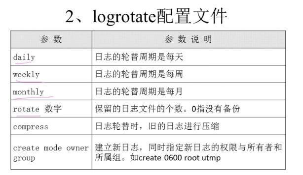

# 日志轮替 
默认配置文件路径 /etc/logrotate.conf

自定义配置文件路径 /etc/logrotate.d/*.conf

# 日志文件的命名规则

## 1. 日期记录文件名字，配置文件中加"dateext"参数

例如，今天日志文件名字是"secure"，到了明天该文件会自动变为"secure-20191001"
,明天的日志文件会新生成secure的日志文件，达到轮替的效果，注意此时需要在配置文件中手动指定
文件的后缀日期显示方式

## 2. 按照顺序记录文件名字，配置文件中没有"dateext"参数

例如，今天日志名字是"secure", 到了明天该文件会自动变为"secure.1"，明天的日志文件会
新生成"secure"的日志文件，达到轮替效果